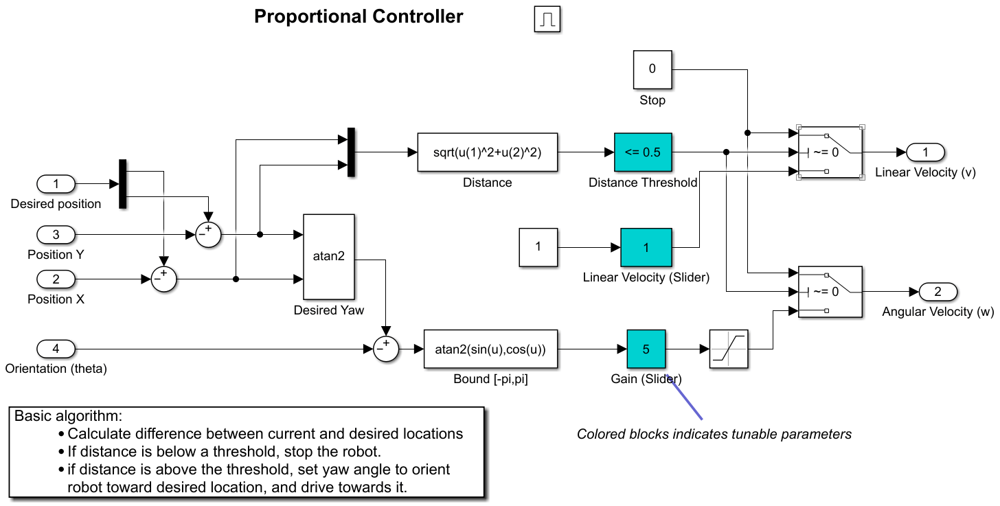

# Design report

### Team:
* Varzonova Nadezhda
* Tunde Derrick

## Brief introduction to the code structure
When structuring the code of our project we tried to follow the [ROS2 best practices](https://docs.ros.org/en/humble/The-ROS2-Project/Contributing/Developer-Guide.html#filesystem-layout) as closely as possible. Although due to the simplicity of the project we sometimes deviated from the mentioned practices list.
For example, since we will probably not export this package to any outside projects (this is a local project) and therefore will not export any libraries as importable downstream dependencies we decided to omit the `include` directory and put our code into `src` folder.
The project has the following modular code sctructure:
* package `assignment_1`
Contains the code for the main node (`control_node`), subscriber node (`subscriber_node`) as well as other files related to building and maintaining this package.
Both `controller_node` and `subscriber_node` are divided into `main` and the class definition code.
* package `speed_interface`
Contains a custom interface designed for the speed service provided by main node. It allows for the setting of the default speed.
The cusom interface is `SetSpeed.srv` and it is located in `/srv` folder.

## Challenges encountered
The first approach we tried was implementing the open-loop control for the robot. That method relied on supplying the calculated and precisely timed linear and angular speed commands to the robot via publishing them to the `/cmdvel` topic. Although in theory it was supposed to be a simple task the simulated robot behaved in an unpredicted manner from time to time. For example, linear motion was performed by the robot without any problems or unexpected events. However, it was not the case for the `turning` commands. To elaborate, at unpredicted intervals after receiving the command to turn around its' `z`-axis at a certain speed the robot would first follow the command by turning around by a calculated angle, then would stop and wait for a subsequent linear motion command, and then instead of going straight it would **drift to the side** rapidly as if one of the differential drive wheels received an angular acceleration. We checked the speed commands published by us to the `/cmdvel` topic very thoroughly, checked the timing and calculations in code, and can conclude with confidence that the mentioned side-drift was not happening due to our code. This drift could not be predicted and could not be fixed by providing the backwards acceleration or introducing a long pause between commands, or changing the publishing rate. 
We managed to overcome this problem by changing our approach and implementing a closed-loop control method instead. In order to not overcomplicate things even further we focused on coding the P-controller. This way we got very close to making the simulated robot drive along a perfect 5m square, and also enabled it to operate in a stable manner over a variety of speeds.

## Design of the programming solution
### P-controller
The robot control was done via publishing the linear and angular velocity messages of type `geometry_msgs/msg/Twist` to the `/cmdvel` topic:
```c++
// send_velocity() in control_node.cpp

geometry_msgs::msg::Twist cmd_vel = geometry_msgs::msg::Twist();
cmd_vel.linear = tf2::toMsg(linear_vel_);
cmd_vel.angular = tf2::toMsg(angular_vel_);
this->vel_pub_->publish(cmd_vel);
```
We based our P-controller implementation on the block-diagram of the P-controller found on [Matlab website](https://www.mathworks.com/help/ros/ug/feedback-control-of-a-ros2-robot.html):

To be precise, we adapted the idea of including the heading angle into our foward motion control routine aside from linear velocity management. We also took the general structure of the control cycle routine.
However, despite basing our approach on the above block diagram we still largely modified our controller to better suit our task.
We used the outside supporting package libraries for the angle normalization and for finding the angular shortest distance which are a very popular choice among ROS community, like `angles` library package.
We also used 3 different proportional gains: 2 for the linear motion (heading angular velocity gain and foward linear velocity gain) and 1 for turning angular velocity gain:
```c++
// controller_node.hpp

// P-controller gains
    // gain for the linear motion control
    const double K_l = 1.0;
    // gain for the heading angle control
    const double K_ha = 10.0;
    // gain for the turning angle control
    const double K_ta = 0.9;
```
The tolerances are applied to each individual level of the control routine:
```c++
// controller_node.hpp

// position tolerances
    const double distanceTolerance = 0.1;
    const double headingAngleTolerance = 0.05;
    const double turnAngleTolerance = 0.01;
```
The entry point of the main control cycle is the function `go_in_square`:
```c++
// control_node.cpp

void TurtleBot3Controller::go_in_square()
{
    if (this->speed_ == 0)
        return;
    static auto iter = setpoints_.begin();

    if (goal_success_)
    {
        iter++;
        if (iter == setpoints_.end())
            iter = setpoints_.begin();
        goal_ = *iter;
        angle_goal_success_  = false;
        goal_success_ = false;

        RCLCPP_DEBUG(this->get_logger(), "GOAL SUCCESS! Next goal: {%f %f}", goal_.x, goal_.y);
    }
    else if (!angle_goal_success_) {
        this->timer_ = this->create_wall_timer(std::chrono::milliseconds(400), std::bind(&TurtleBot3Controller::go_in_square, this));

        turn_control_cycle();
    }
    else {
        this->timer_ = this->create_wall_timer(std::chrono::milliseconds(15), std::bind(&TurtleBot3Controller::go_in_square, this));
        control_cycle();
    }
}
```
Here for the turning angle control we tweaked the timers to reduce the publishing rate of the velocity commands. 
We split control cycle into 2 parts: linear motion control and turning angle control:
```c++
// controller_node.hpp

void control_cycle();
void turn_control_cycle();
```
All these modifications and strange code solutions were intended to compensate for the above-mentioned unexpected **side-drift** happening in simulation. We manage to reduce it by implementing the modifications mentioned previously by us. Unfortunately, the side drift could be pretty violent at times but due to the nature of feedback-supported control the robot would quickly adapt and arrive to the waypoint destination regardless.
However, while at lower speeds the square would still be close to ideal (shape, origin not shifting) at higher speeds (>1.6 m/s) the robot would perform more effort to compensate for the drift, therefore the perfect square would become less perfect in such conditions. However, this is expected as any controller can't work perfectly at any existing speeds or parameters and needs to be tuned.
We should also point out that any P-controller would produce an accumulating steady state error and ours is not an exception. This steady-state error becomes more noticeable when we invoke the subscriber node which calculates the running distance.
The typical control cycle loop looks as following in code:
```c++
// control_cycle() in control_node.cpp

auto odom2robot_ptr = this->get_position();
if (odom2robot_ptr == nullptr)
    return;
auto odom2robot = *(odom2robot_ptr.get());

double x = odom2robot.transform.translation.x;
double y = odom2robot.transform.translation.y;

orientation_.setX(odom2robot.transform.rotation.x);
orientation_.setY(odom2robot.transform.rotation.y);
orientation_.setZ(odom2robot.transform.rotation.z);
orientation_.setW(odom2robot.transform.rotation.w);

double yaw = tf2::getYaw(orientation_);

double x_diff = goal_.x - x;
double y_diff = goal_.y - y;
double yaw_desired = atan2(y_diff, x_diff);
double yaw_diff = angles::shortest_angular_distance(yaw, yaw_desired);

double vel_x = get_linear_velocity(x_diff, y_diff);
old_vel = vel_x;
linear_vel_.setX(vel_x);
// handle goal success further
...
```
And here's the velocity calculation with the gain and feedback:
```c++
// get_linear_velocity() in control_node.cpp

double vel_x = 0;
double dist = std::sqrt(std::pow(x, 2) + std::pow(y, 2));

if (abs(dist) > distanceTolerance) {
    vel_x = K_l * dist;
    if (abs(vel_x) > this->speed_)
        vel_x = (dist > 0)? this->speed_ : this->speed_*-1;
}
return vel_x;
```

### Static points-based approach
Our approach to controlling the robot involves a 'waypoint' position primitive:
```c++
// control_node.hpp

struct Setpoint {
    double x;
    double y;
    double yaw;
};
...
// private data
std::vector<Setpoint> setpoints_;
Setpoint goal_;
```
In essence we define our square as a path binded by 4 setpoints with the coordinates defined in robot's global coordinates frame. We decided to base motion control on following the setpoints as precisely as possible because it's a common practice in robotics and also because the implemented code will become very useful in future robot navigation tasks.
Other than that, it's a reliable technique for controlling the robot by using the P-controller - we are confident that even if we leave the robot driving in a square for a very long time the P-controller will take care of closely following the setpoints, and so as we return we will find our robot following the approximately same 5m square as we expect it to; even though the steady state error will alter the square a bit.
In the constructor of the control node the vector containing the setpoints in initialized as follows:
```c++
// init_setpoints() in control_node.cpp
rclcpp::Rate rate(1s);

// we assign the coordinates relative to the fixed frame - start of motion
geometry_msgs::msg::TransformStamped::SharedPtr odom2robot_ptr;
// simulated robot is not spawned yet - wait
while ((odom2robot_ptr = this->get_position()) == nullptr) {
    rate.sleep();
}

auto odom2robot = *(odom2robot_ptr.get());
double x_origin = odom2robot.transform.translation.x;
double y_origin = odom2robot.transform.translation.y;
orientation_.setX(odom2robot.transform.rotation.x);
orientation_.setY(odom2robot.transform.rotation.y);
orientation_.setZ(odom2robot.transform.rotation.z);
orientation_.setW(odom2robot.transform.rotation.w);
    
double yaw_origin = tf2::getYaw(orientation_);

setpoints_.push_back({x_origin+5, y_origin, yaw_origin});
setpoints_.push_back({x_origin+5, y_origin+5, normalize_angle(yaw_origin+M_PI_2)});
setpoints_.push_back({x_origin, y_origin+5, normalize_angle(yaw_origin+2*M_PI_2)});
setpoints_.push_back({x_origin, y_origin, normalize_angle(yaw_origin+3*M_PI_2)});
```

### Choice of the coordinates origin
Since the 6D pose shall be reported with respect to a fixed reference frame, we chose `/odom` (starting point of the motion) frame for this purpose.
The subscriber node receives the 6D pose relative to this fixed coordinate frame:
```c++
// publish_pose() in control_node.cpp

geometry_msgs::msg::PoseStamped pose = geometry_msgs::msg::PoseStamped();
pose.pose.position.x = odom2robot.transform.translation.x;
pose.pose.position.y = odom2robot.transform.translation.y;
pose.pose.position.z = odom2robot.transform.translation.z;
tf2::convert(odom2robot.transform.rotation, pose.pose.orientation);

this->pose_pub_->publish(pose);
```
The main node also continuously monitors the position of the robot in 2D-space as a feedback in feedback-loop relative to the `/odom` frame.
The robot's coordinates relative to `/odom` are received with the help of `tf2` ROS2's library by creating a transform listener which listens on published transforms:
```c++
// control_node.hpp

// coordinates transform
tf2::BufferCore tf_buffer_;
tf2_ros::TransformListener tf_listener_;
```
The received transform translates the robot's local coordinates to the global coordinates in fixed reference frame.
Here's the routine to get the relevant transform:
```c++
// get_position() in control_node.cpp

geometry_msgs::msg::TransformStamped odom2robot;

try {
    odom2robot = tf_buffer_.lookupTransform("odom", "base_footprint", tf2::TimePointZero);
} catch (tf2::TransformException& e) {
    RCLCPP_ERROR(this->get_logger(), "Odom to robot transform not found: %s", e.what());
    return nullptr;
}
return std::make_shared<geometry_msgs::msg::TransformStamped>(std::move(odom2robot));
```

### Choice of standart messages for 6D position exchange
We chose `geometry_msgs/msg/PoseStamped` for publishing the 6D position because it conveniently contains the header with the time stamp (in complete implementation it would be beneficial to know the time of the message creation), vector for the 3D position and quaternion for 3D orientation.

### Functionalities
As mentioned previously, the main `controller_node` takes care of controlling the robot and making it going along the 5m square.
It continuously publishes the 6D position of the robot.
It also provides a service for setting the default speed which is then used as both forward and angular speed:
```c++
// control_node.hpp

void set_speed(const std::shared_ptr<speed_interface::srv::SetSpeed::Request>);

// control_node.cpp

// service for default speed setting
this->speed_service_ = this->create_service<speed_interface::srv::SetSpeed>("set_speed", std::bind(&TurtleBot3Controller::set_speed, this, _1));

// custom interface in speed_interface package
// SetSpeed.srv
float64 speed
---
```
Can be called via command:
```zsh
$ ros2 service call /set_speed speed_interface/srv/SetSpeed "{speed: 1.5}"
```
We also implemented a callback for setting the same speed configuration via a ROS parameter:
```c++
...
// checking if the changed parameter is of the right type
if (param.get_name() == "speed" && param.get_type() == rclcpp::ParameterType::PARAMETER_DOUBLE) 
{
    if (param.as_double() >= MAX_SPEED)
    {
        RCLCPP_WARN(this->get_logger(), "Setting maximum supported speed: %f. Consider switching to lower speed to avoid operating yourobot at critical conditions.", param.as_double());
        RCLCPP_WARN(this->get_logger(), "Robot might behave in unstable manner. Consider increasing the tolerances if you want to run amaximum speed.");
        this->speed_ = MAX_SPEED;
    }
    else {
        this->speed_ = param.as_double();
        RCLCPP_INFO(this->get_logger(), "Parameter 'speed' has changed. The new value is: %f", param.as_double());
    }
} 
else
{
    result.successful = false;
    result.reason = "Unsupported parameter";
}
...
```
It can be set with the command:
```zsh
$ ros2 param set /control_node speed 1.5
```

### Supporting libraries and other dependencies
The following supporting libraries were imported:
```cmake
find_package(tf2 REQUIRED)
find_package(tf2_geometry_msgs REQUIRED)
find_package(angles REQUIRED)
```
Quaternion handling involving conversion to Euler angles back and forth as well as transformations between different `geometry_msgs` types and `tf2` position and orientation primitives were done via `tf2` library calls:
```c++
...
tf2::convert(odom2robot.transform.rotation, pose.pose.orientation);
...
double yaw_origin = tf2::getYaw(orientation_);
...
cmd_vel.linear = tf2::toMsg(linear_vel_);
...
```
Angles normalization was performed with `angles` library:
```c++
double yaw_diff = angles::shortest_angular_distance(yaw, goal_.yaw);
```
Running distance, Roll, Pitch & Yaw angles were calculated in subscriber node also using the `tf2` library:
```c++
// pose_callback() in subscriber_node.cpp
double roll, pitch, yaw;

tf2::Quaternion curr_orientation;
tf2::fromMsg(pose.pose.orientation, curr_orientation);
tf2::getEulerYPR(curr_orientation, yaw, pitch, roll);

tf2::Vector3 curr_pose(pose.pose.position.x, pose.pose.position.y, pose.pose.position.z);
this->distance += tf2::tf2Distance(this->prev_position_, curr_pose);
```

### Description of the launch file
We implemented the launch file in Python. It is contained in `/launch` folder of the `assignment_1` package.
In order to smoothly restart the simulation each time we launch the project the following parameter was added:
```python
control_node = Node(
    package="assignment_1",
    executable="control_node",
    name='control_node',
    respawn=True, # this parameter is needed
)
```

### Robot operating limits
Although the real TurtleBot3 Waffle's nominal maximum translational velocity is 0.26 m/s and rotational is 1.82 rad/s (104.27 deg/s) we didn't limit our application to such a small speed range. Our P-controller manages to drive the robot smoothly up to ~1.6 m/s and handles the speeds up to 2 m/s fairly well. Therefore, we set the maximum speed limit to 2 m/s.
```c++
// control_node.hpp

// constants
#define SQUARE_POLYGON 5.0
#define DEFAULT_SPEED 1.0
#define MAX_SPEED 2.0

// set_speed() in control_node.cpp

if (request->speed >= MAX_SPEED)
{
    RCLCPP_WARN(this->get_logger(), "Setting maximum supported speed: %f. Consider switching to lower speed to avoid operating your robot at critical conditions.", MAX_SPEED);
    RCLCPP_WARN(this->get_logger(), "Robot might behave in unstable manner. Consider increasing the tolerances if you want to run at maximum speed.");
    this->speed_ = MAX_SPEED;
}
else
    this->speed_ = request->speed;
```

## How to build
First go to the `src` directory:
```zsh
$ cd ~/mobile_robots_programming/src
$ colcon build
$ source install/setup.bash
```

## How to launch
To run the project with simulation and both the subscriber node and controller node running type the commands:
```zsh
$ ros2 run assignment_1 subscriber_node
$ ros2 launch assignment_1 controller.launch.py
```
Output:
```zsh
...
[INFO] [1714705097.304009244] [subscriber_node]: Total running distance: 160.202663
[INFO] [1714705097.453033213] [subscriber_node]: Roll: 0.000009, Pitch: 0.006617, Yaw: -1.572704
[INFO] [1714705097.453348658] [subscriber_node]: Total running distance: 160.457668
...
[gzserver-1] [INFO] [1714704704.560726082] [turtlebot3_diff_drive]: Advertise odometry on [/odom]
[gzserver-1] [INFO] [1714704704.563562688] [turtlebot3_diff_drive]: Publishing odom transforms between [odom] and [base_footprint]
[gzserver-1] [INFO] [1714704704.572913833] [turtlebot3_joint_state]: Going to publish joint [wheel_left_joint]
[gzserver-1] [INFO] [1714704704.572964812] [turtlebot3_joint_state]: Going to publish joint [wheel_right_joint]
[control_node-5] [INFO] [1714704771.952095716] [control_node]: Parameter 'speed' has changed. The new value is: 1.500000
```
